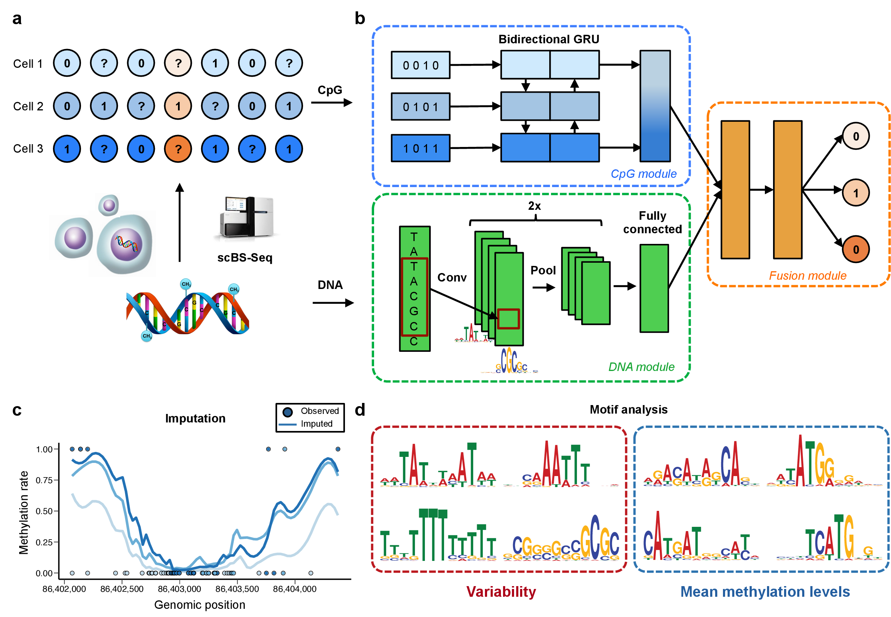

========================================================================
DeepCpG: Deep neural networks for predicting single-cell DNA methylation
========================================================================

|Version| |License| |PyPI| |Docs| |Tweet|

.. |Version| image:: https://img.shields.io/badge/python-2.7%2B%2C3.4%2B-green.svg
  :target: https://www.python.org/

.. |License| image:: https://img.shields.io/github/license/mashape/apistatus.svg
  :target: https://github.com/cangermueller/deepcpg/tree/master/LICENSE

.. |PyPI| image:: https://img.shields.io/badge/pypi-latest-orange.svg
  :target: https://pypi.python.org/pypi/deepcpg

.. |Docs| image:: https://img.shields.io/badge/docs-up--to--date-brightgreen.svg
  :target: http://deepcpg.readthedocs.io

.. |Tweet| image:: https://img.shields.io/twitter/url/http/shields.io.svg?style=social
  :target: https://twitter.com/intent/tweet?text=Checkout+%23DeepCpG%3A+%23DeepLearning+for+predicting+DNA+methylation%2C+%40cangermueller 

DeepCpG is a deep neural network for predicting the methylation state of CpG dinucleotides in multiple cells. It allows to accurately impute incomplete DNA methylation profiles, to discover predictive sequence motifs, and to quantify the effect of sequence mutations. (`Angermueller et al, 2017 <http://biorxiv.org/content/early/2017/02/01/055715>`_).

**DeepCpG model training and applications.** (a) Sparse
single-cell CpG profiles, for example as obtained from scBS-seq or
scRRBS-seq. Methylated CpG sites are denoted by ones, un-methylated CpG
sites by zeros, and question marks denote CpG sites with unknown methylation
state (missing data). (b) Modular architecture of DeepCpG. The DNA module
consists of two convolutional and pooling layers to identify predictive motifs
from the local sequence context, and one fully connected layer to model motif
interactions. The CpG module scans the CpG neighbourhood of multiple cells
(rows in b), using a bidirectional gated recurrent network (GRU),
yielding compressed features in a vector of constant size. The fusion module
learns interactions between higher-level features derived from the DNA- and
CpG module to predict methylation states in all cells. (c,d) The trained
DeepCpG model can be used for different downstream analyses, including
genome-wide imputation of missing CpG sites (c) and the discovery of DNA
sequence motifs that are associated with DNA methylation levels or
cell-to-cell variability (d).

.. code::

  Angermueller, Christof, Heather Lee, Wolf Reik, and Oliver Stegle. Accurate Prediction of Single-Cell DNA Methylation States Using Deep Learning. http://biorxiv.org/content/early/2017/02/01/055715 bioRxiv, February 1, 2017, 55715. doi:10.1101/055715.

Table of contents
=================
* `Installation`_
* `Getting started with DeepCpG in 30 seconds`_
* `Examples`_
* `Model Zoo`_
* `FAQ`_
* `Content`_
* `Contact`_

Installation
============

The easiest way to install DeepCpG is to use ``PyPI``:

.. code:: bash

  pip install deepcpg

Alternatively, you can checkout the repository,

.. code:: bash

  git clone https://github.com/cangermueller/deepcpg.git

and then install DeepCpG using ``setup.py``:

.. code:: bash

  python setup.py install

Getting started with DeepCpG in 30 seconds
==========================================

1. Store known CpG methylation states of each cell into a tab-delimted file with the following columns:

* Chromosome (without chr)
* Position of the CpG site on the chromosome starting with one
* Binary methylation state of the CpG sites (0=unmethylation, 1=methylated)

Example:

.. code::

  1   3000827   1.0
  1   3001007   0.0
  1   3001018   1.0
  ...
  Y   90829839  1.0
  Y   90829899  1.0
  Y   90829918  0.0

2. Run ``dcpg_data.py`` to create the input data for DeepCpG:

.. code:: bash

  dcpg_data.py
  --cpg_profiles ./cpg/cell1.tsv ./cpg/cell2.tsv ./cpg/cell3.tsv
  --dna_files ./dna/*.dna.chromosome.*.fa*
  --cpg_wlen 50
  --out_dir ./data

``./cpg/cell[123].tsv`` store the methylation data from step 1., ``./dna`` contains the DNA database, e.g. `mm10 <http://ftp.ensembl.org/pub/release-85/fasta/mus_musculus/dna/>`_ for mouse or `hg38 <http://ftp.ensembl.org/pub/release-86/fasta/homo_sapiens/dna/>`_ for human, and output data files will be stored in ``./data``.

3. Fine-tune a pre-trained model or train your own model from scratch with ``dcpg_train.py``:

.. code:: bash

  dcpg_train.py
    ./data/c{1,2,3}_*.h5
    --val_data ./data/c{10,11,13}_*.h5
    --dna_model CnnL2h128
    --cpg_model RnnL1
    --joint_model JointL2h512
    --nb_epoch 30
    --out_dir ./model

This command uses chromosomes 1-3 for training and 10-13 for validation. ``---dna_model``, ``--cpg_model``, and ``--joint_model`` specify the architecture of the CpG, DNA, and joint module, respectively (see manuscript for details). Training will stop after at most 30 epochs and model files will be stored in ``./model``.

4. Use ``dcpg_eval.py`` to predict missing methylation states and evaluate prediction performances:

.. code:: bash

  dcpg_eval.py
    ./data/c*.h5
    --model_files ./model/model.json ./model/model_weights_val.h5
    --out_data ./eval/data.h5
    --out_report ./eval/report.tsv

This command predicts missing methylation states of all cells and chromosomes and evaluates prediction performances using known methylation states. Predicted states will be stored in ``./eval/data.h5`` and performance metrics in ``./eval/report.tsv``.

5. Export imputed methylation profiles to bedGraph files:

.. code:: bash

  dcpg_eval_export.py
    ./eval/data.h5
    -o ./eval
    -f bedGraph

Examples
========

Interactive examples on how to use DeepCpG can be found `here <examples/index.md>`_.

Model Zoo
=========

Pre-trained models can be downloaded from the `DeepCpG model zoo <docs/models.md>`_.

FAQ
===

**Why am I getting warnings 'No CpG site at position X!' when using `dcpg_data.py`?**
This means that some sites in ``--cpg_profile`` files are not CpG sites, e.g. there is no CG dinucleotide at the given position in the DNA sequence. Make sure that ``--dna_files`` point to the correct genome and CpG sites are correctly aligned. Since DeepCpG currently does not support allele-specific methylation, data from different alleles must be merged (recommended) or only one allele be used.

**How can I train models on one or more GPUs?**
DeepCpG use the `Keras <https://keras.io>`_ deep learning library, which supports `Theano <http://deeplearning.net/software/theano/>`_ or `Tensorflow <https://www.tensorflow.org/>`_ as backend. If you are using Tensorflow, DeepCpG will automatically run on all available GPUs. If you are using Theano, you have to set the flag `device=GPU` in the `THEANO_FLAGS` environment variable.

.. code:: bash

  THEANO_FLAGS='device=gpu,floatX=float32'

You can find more information about Keras backends `here <https://keras.io/backend/>`_, and about parallelization `here <https://keras.io/getting-started/faq/#how-can-i-run-keras-on-gpu>`_.

Content
=======
* ``/deepcpg/``: Source code
* ``/docs``: Documentation
* ``/examples/``: Examples on how to use DeepCpG
* ``/script/``: Executable scripts for data creation, model training, and interpretation
* ``/tests``: Test files

Contact
=======
* Christof Angermueller
* cangermueller@gmail.com
* https://cangermueller.com
* `@cangermueller <https://twitter.com/cangermueller>`_
