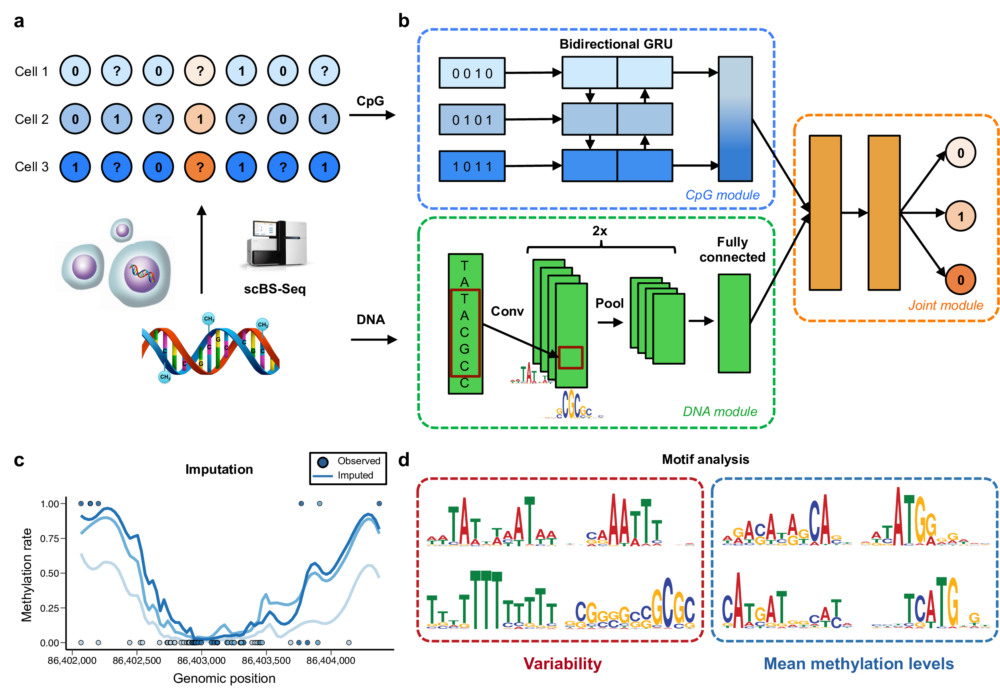

========================================================================
DeepCpG: Deep neural networks for predicting single-cell DNA methylation
========================================================================

|Version| |License| |PyPI| |Docs| |DOI| |Tweet|

.. |Version| image:: https://img.shields.io/badge/python-2.7%2B%2C3.4%2B-green.svg
  :target: https://www.python.org/

.. |License| image:: https://img.shields.io/github/license/mashape/apistatus.svg
  :target: https://github.com/cangermueller/deepcpg/tree/master/LICENSE

.. |PyPI| image:: https://img.shields.io/badge/pypi-latest-orange.svg
  :target: https://pypi.python.org/pypi/deepcpg

.. |Docs| image:: https://img.shields.io/badge/docs-up--to--date-brightgreen.svg
  :target: http://deepcpg.readthedocs.io

.. |DOI| image:: https://zenodo.org/badge/68630079.svg
   :target: https://zenodo.org/badge/latestdoi/68630079

.. |Tweet| image:: https://img.shields.io/twitter/url/http/shields.io.svg?style=social
  :target: https://twitter.com/intent/tweet?text=Checkout+%23DeepCpG%3A+%23DeepLearning+for+predicting+DNA+methylation%2C+%40cangermueller

DeepCpG [1]_ is a deep neural network for predicting the methylation state of CpG dinucleotides in multiple cells. It allows to accurately impute incomplete DNA methylation profiles, to discover predictive sequence motifs, and to quantify the effect of sequence mutations. (`Angermueller et al, 2017 <http://dx.doi.org/10.1186/s13059-017-1189-z>`_).

**Please help to improve DeepCpG**, by reporting bugs, typos in notebooks and documentation, or any ideas on how to make things better. You can submit an `issue <https://github.com/cangermueller/deepcpg/issues>`_ or send me an `email <mailto:cangermueller@gmail.com>`_.

   **DeepCpG model architecture and applications.**

   \(a\) Sparse single-cell CpG profiles as obtained from scBS-seq or scRRBS-seq. Methylated CpG sites are denoted by ones, unmethylated CpG sites by zeros, and question marks denote CpG sites with unknown methylation state (missing data). (b) DeepCpG model architecture. The DNA model consists of two convolutional and pooling layers to identify predictive motifs from the local sequence context, and one fully connected layer to model motif interactions. The CpG model scans the CpG neighborhood of multiple cells (rows in b), using a bidirectional gated recurrent network (GRU), yielding compressed features in a vector of constant size. The Joint model learns interactions between higher-level features derived from the DNA- and CpG model to predict methylation states in all cells. (c, d) The trained DeepCpG model can be used for different downstream analyses, including genome-wide imputation of missing CpG sites (c) and the discovery of DNA sequence motifs that are associated with DNA methylation levels or cell-to-cell variability (d).

.. [1] Angermueller, Christof, Heather J. Lee, Wolf Reik, and Oliver Stegle. *DeepCpG: Accurate Prediction of Single-Cell DNA Methylation States Using Deep Learning.* Genome Biology 18 (April 11, 2017): 67. doi:10.1186/s13059-017-1189-z.

Table of contents
=================
* `News`_
* `Installation`_
* `Getting started`_
* `Examples`_
* `Model Zoo`_
* `FAQ`_
* `Content`_
* `Changelog`_
* `Contact`_

News
====

* **181201**: DeepCpG 1.0.7 released!
* **180224**: DeepCpG 1.0.6 released!
* **171112**: Keras 2 is now the main Keras version (release 1.0.5).
* **170412**: New `notebook <./examples/notebooks/stats/index.ipynb>`_ on predicting inter-cell statistics!
* **170414**: Added `dcpg_eval_perf.py <./scripts/dcpg_eval_perf.py>`_ and `dcpg_eval_perf.Rmd <./R/dcpg_eval_perf.Rmd>`_ for evaluating and visualizing prediction performances! Find an example in `this notebook <./examples/notebooks/basics/index.ipynb#Evaluating-prediction-performances>`_!
* **170412**: New `notebook <./examples/notebooks/stats/index.ipynb>`_ on predicting inter-cell statistics!
* **170410**: New `notebook <./examples/notebooks/snp/index.ipynb>`_ on estimating mutation effects!
* **170406**: A short description of all `DeepCpG scripts <http://deepcpg.readthedocs.io/latest/scripts/index.html>`_!
* **170404**: New guide on creating and analyzing DeepCpG data `released <http://deepcpg.readthedocs.io/latest/data.html>`_!
* **170404**: Training on continuous data, e.g. from bulk experiments, now `supported <http://deepcpg.readthedocs.io/latest/data.html>`_!

Installation
============

The easiest way to install DeepCpG is to use ``PyPI``:

.. code:: bash

  pip install deepcpg

Alternatively, you can checkout the repository,

.. code:: bash

  git clone https://github.com/cangermueller/deepcpg.git

and then install DeepCpG using ``setup.py``:

.. code:: bash

  python setup.py install

Getting started
===============

1. Store known CpG methylation states of each cell into a tab-delimted file with the following columns:

* Chromosome (without chr)
* Position of the CpG site on the chromosome starting with one
* Binary methylation state of the CpG sites (0=unmethylation, 1=methylated)

Example:

.. code::

  1   3000827   1.0
  1   3001007   0.0
  1   3001018   1.0
  ...
  Y   90829839  1.0
  Y   90829899  1.0
  Y   90829918  0.0

2. Run ``dcpg_data.py`` to create the input data for DeepCpG:

.. code:: bash

  dcpg_data.py
  --cpg_profiles ./cpg/cell1.tsv ./cpg/cell2.tsv ./cpg/cell3.tsv
  --dna_files ./dna/mm10
  --cpg_wlen 50
  --dna_wlen 1001
  --out_dir ./data

``./cpg/cell[123].tsv`` store the methylation data from step 1., ``./dna`` contains the DNA database, e.g. `mm10 <http://ftp.ensembl.org/pub/release-85/fasta/mus_musculus/dna/>`_ for mouse or `hg38 <http://ftp.ensembl.org/pub/release-86/fasta/homo_sapiens/dna/>`_ for human, and output data files will be stored in ``./data``.

3. Fine-tune a pre-trained model or train your own model from scratch with ``dcpg_train.py``:

.. code:: bash

  dcpg_train.py
    ./data/c{1,3,6,7,9}_*.h5
    --val_data ./data/c{13,14,15,16,17,18,19}_*.h5
    --dna_model CnnL2h128
    --cpg_model RnnL1
    --joint_model JointL2h512
    --nb_epoch 30
    --out_dir ./model

This command uses chromosomes 1-3 for training and 10-13 for validation. ``---dna_model``, ``--cpg_model``, and ``--joint_model`` specify the architecture of the CpG, DNA, and Joint model, respectively (see manuscript for details). Training will stop after at most 30 epochs and model files will be stored in ``./model``.

4. Use ``dcpg_eval.py`` to impute methylation profiles and evaluate model performances.

.. code:: bash

  dcpg_eval.py
    ./data/*.h5
    --model_files ./model/model.json ./model/model_weights_val.h5
    --out_data ./eval/data.h5
    --out_report ./eval/report.tsv

This command predicts missing methylation states on all chromosomes and evaluates prediction performances using known methylation states. Predicted states will be stored in ``./eval/data.h5`` and performance metrics in ``./eval/report.tsv``.

5. Export imputed methylation profiles to HDF5 or bedGraph files:

.. code:: bash

  dcpg_eval_export.py
    ./eval/data.h5
    -o ./eval/hdf
    -f hdf

Examples
========

You can find example notebooks and scripts on how to use DeepCpG in `/examples <examples/README.md>`_. R scripts and Rmarkdown files for downstream analyses are stored in `/R <R/README.md>`_.

Documentation
=============

The `DeepCpG documentation <http://deepcpg.readthedocs.io>`_ provides information on training, hyper-parameter selection, and model architectures.

Model Zoo
=========

You can download pre-trained models from the `DeepCpG model zoo <docs/source/zoo.md>`_.

FAQ
===

**Why am I getting warnings 'No CpG site at position X!' when using `dcpg_data.py`?**
This means that some sites in ``--cpg_profile`` files are not CpG sites, i.e. there is no CG dinucleotide at the given position in the DNA sequence. Make sure that ``--dna_files`` point to the correct genome and CpG sites are correctly aligned. Since DeepCpG currently does not support allele-specific methylation, data from different alleles must be merged (recommended) or only one allele be used.

**How can I train models on one or more GPUs?**
DeepCpG use the `Keras <https://keras.io>`_ deep learning library, which supports `Theano <http://deeplearning.net/software/theano/>`_ or `Tensorflow <https://www.tensorflow.org/>`_ as backend. If you are using Tensorflow, DeepCpG will automatically run on all available GPUs. If you are using Theano, you have to set the flag `device=GPU` in the `THEANO_FLAGS` environment variable.

.. code:: bash

  THEANO_FLAGS='device=gpu,floatX=float32'

You can find more information about Keras backends `here <https://keras.io/backend/>`_, and about parallelization `here <https://keras.io/getting-started/faq/#how-can-i-run-keras-on-gpu>`_.

Content
=======
* ``/deepcpg/``: Source code
* ``/docs``: Documentation
* ``/examples/``: Examples on how to use DeepCpG
* ``/R``: R scripts and Rmarkdown files for downstream analyses
* ``/script/``: Executable DeepCpG scripts
* ``/tests``: Test files

Changelog
=========

1.0.7
-----
* Add support for Keras >=2.2.0.

1.0.6
-----
* Add support for Keras 2.1.4 and Tensorflow 1.5.0
* Minor bug-fixes.

1.0.5
-----
Uses Keras 2 as main Keras version.

1.0.4
-----
Adds evaluation scripts and notebooks, improves documentation, and fixes minor bugs.
  + Adds `dcpg_eval_perf.py <http://deepcpg.readthedocs.io/en/latest/scripts/index.html#module-scripts.dcpg_eval_perf>`_ and R markdown files for computing and visualizing performance metrics genome-wide and in annotated contexts.
  + Adds `dcpg_snp.py <http://deepcpg.readthedocs.io/en/latest/scripts/index.html#module-scripts.dcpg_snp>`_ for computing mutation effects.
  + Adds notebooks on computing mutation effects and predicting inter-cell statistics.
  + Adds documentation of `DeepCpG scripts <http://deepcpg.readthedocs.io/latest/scripts/index.html>`_.
  + Adds integration tests.
  + Includes minor bug-fixes.

1.0.3
-----
Extends ``dcpg_data.py``, updates documentation, and fixes minor bugs.
  + Extends ``dcpg_data.py`` to support bedGraph and TSV input files.
  + Enables training on continuous methylation states.
  + Adds `documentation <http://deepcpg.readthedocs.io/en/latest/data.html#data>`_ about creating and analyzing Data.
  + Updates documentation of `scripts <http://deepcpg.readthedocs.io/en/latest/scripts/index.html#scripts>`_ and `library <http://deepcpg.readthedocs.io/en/latest/lib/index.html#library>`_.

Contact
=======
* Christof Angermueller
* cangermueller@gmail.com
* https://cangermueller.com
* `@cangermueller <https://twitter.com/cangermueller>`_
